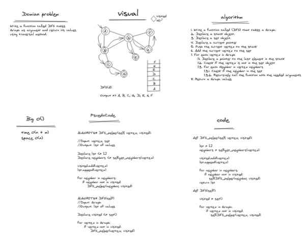

# Graph CC: 35


## Overview
* We created a Graph class represented as an adjacency list
* see the summary for graphs 

### Graphs
```
-- collection of vertices and edges
-- Many classifications
---- directed, undirected, cyclic, acyclic, connected, disconnected, complete
-- vertices are considered to have neighbors and degrees
---- degrees: number of edges connected to a vertex
---- neighbor: an adjacent/connected vertex
```

### Directed vs undirected
```
-- Directed graphs are like trees
---- each vertex (node) points one direction (to the next node)
-- Undirected graphs have bi-directional edges
---- each edge points to both nodes
```


### Complete, Connected, Disconnected
```
-- Complete graphs have each vertex pointing to every other vertex
-- connected graphs: every vertex has an edge
-- disconnected graphs: some vertexes do not have edges
```

### Acyclic vs cyclic
```
-- Cyclic is synonymous with circle
---- In a cyclic graph the edges and directions make it circular
---- possible to end up at the same node that you started with
-- Acyclic is not circular
---- these do not have a cycle (way to get back to the start)
```


### Graph representation
```
-- Adjacency matrix and adjacency list
-- adjacency matrix: two dimensional array of 1's and 0's
---- 1 signifies a connected node (edge)
---- 0 signifies no edge
-- Adjacency list: collection of linked lists
---- point to edges
```

### Approach & Efficiency

* 1. An adjacency list was the chosen data structure to use for the Graph and a list was the chosen data structure for to use at each index of the adjacency list to handle collisions.

* 2. Adding key/value pairs and getting values from the adjacency list is essentially O(1) for time for both posting and getting. 
* 3. The worst case would be the length of the linked list at any given index. 

## API
My Graph has many public methods:

1. **`add_vertix(value)`**: adds a new node to the graph, returns the added node
2. **`add_edge(start_vertix, end_vertix, weight = 0)`**: adds new edge between two nodes, takes in two nodes, has ability to add weight
3. **`get_vertices()`**: returns all of the nodes as a collection
4. **`get_neighbors(vertix)`**: returns a collection of nodes (with weights) connected to a node, takes in a node
5. **`size()`**: returns number of nodes in Graph; integer
6. **`BFS(self, start_vertix, action = (lambda x : None)`**: Graph Breadth First Search function
7. **`DFS(self)`**: Graph Depth First Search function
8. **`DFS_helper(self, vertex, visited)`**: Graph Depth First Search helper function


## whiteboard




