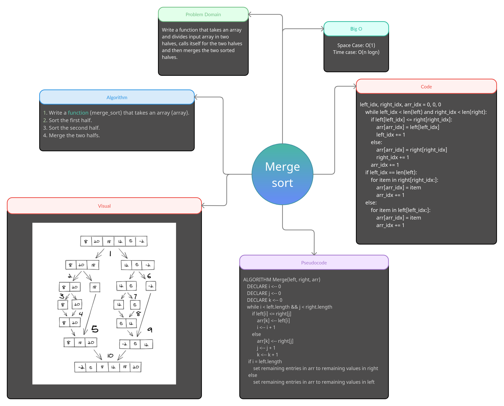

# Code Challenge 27: Merge Sort

> *Merge Sort on a given array.*

**note :** *Merge sort is a divide and conquer sorting algorithm. It recursiveley splits each portion of the origin array until it's comparing only two arrays with a single element each. It then merges the sorted subarrays back together.*

## Tests

1. **test_empty_list:** *Test that empty list is handled correctly.*
2. **test_one_item_list:** *Test that single list item is handled correctly.*
3. **test_two_item_list:** *Test that list with two items is handled correctly.*
4. **test_many_item_list:** *Test that normal list is handled correctly.*

## Challenge

1. Provide a visual step through in BLOG.md for one of the sample arrays based on the provided pseudo code
2. Convert the pseudo-code into working code in your language
3. Present a complete set of working tests

## Big O notation

> time <- O(n log n)
> space <- O(1)

## White-Board
