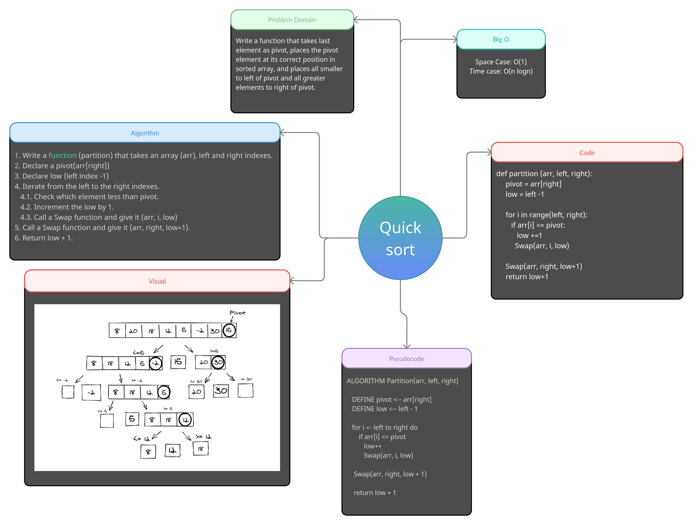

# Quick Sort CC 28

> **Implement quick sort on a given array.**

*A conquer and divide style sorting algorythm. It chooses a pivot value and partitions the input array into a left and right array. The main difference between merge sort and quick sort is that by the time quick sort has broken up the array into sub arrays of single elements the array is sorted.*
___
## Tests

1. **test_empty_list:** Test if empty list is handled correctly.
2. **test_repeated_items:** Test if repeated elemnts list is handled correctly.
3. **test_big_list:** Test if a big list is handled correctly.
4. **test_negative_item_list:** Test if nigative values list is handled correctly.
___
## Challenge

1. Provide a visual step through in BLOG.md for each of the sample arrays based on the provided pseudo code
2. Convert the pseudo-code into working code in your language
3. Present a complete set of working tests

___
## Big O notation

> time <- O(n log n)

> space <- O(n)
  
___

## Whiteboard

