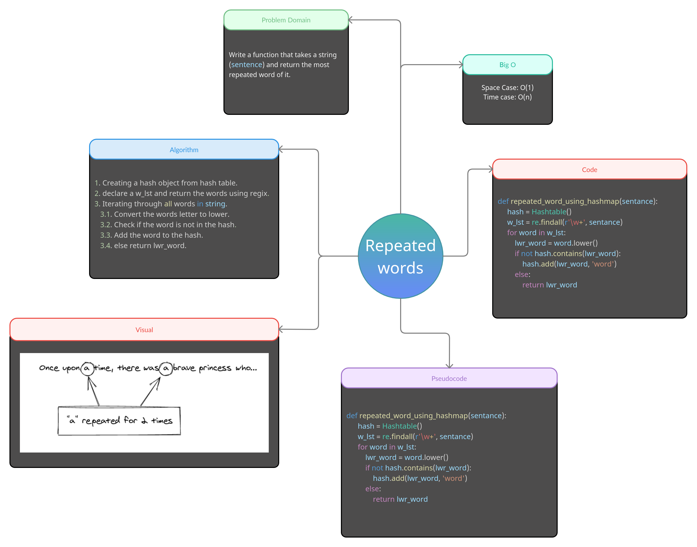

# Repeated Word: CC 31

## Challenge 
1. Write a function that accepts a lengthy string parameter.
2. Without utilizing any of the built-in library methods available to your language. 
3. return the first word to occur more than once in that provided string.

## Approach 
1. **Using `defaultdict`:** Returns a new dictionary-like object. defaultdict is a subclass of the built-in dict class. It overrides one method and adds one writable instance variable. The remaining functionality is the same as for the dict class.

2. **Returning:** the most repeated word in a sentance.

## Efficiency

> Time: O(n)

> Space: O(N)

## White-Board
